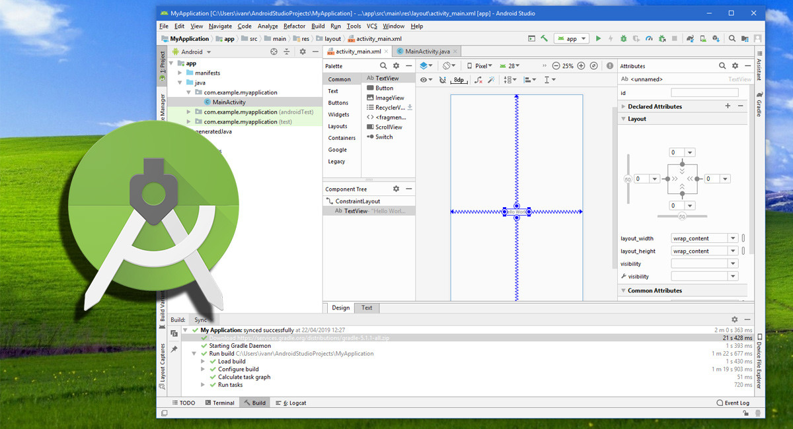

# 2025-1 Programación Movil - Quiz
Este aplicativo móv- [Configuración del Ambiente de Desarrollo](#configuración-del-ambiente-de-desarrollo)
## Configuración del Ambiente de Desarrollo

*Figura 1: Instalacion de Android Studio*

# Diagrama de Despliegue:

Nuestro Diagrama de despliegue muestra una arquitectura distribuida en donde el usuario interactua en una app movil (AprendeMath) que sera en diapositivos Android, donde se ejecutara un protocolo HTTPS, con un servicio de  con un servicio backend desplegado en Azure App Service, que procesa las solicitudes y ejecuta la lógica de negocio. A su vez, el backend consulta y almacena la información en una base de datos Azure SQL Database denominada "dataPrograMovil", mediante conexiones internas seguras dentro de la nube de Azure. 

*<b>Figura 2:</b> Diagrama de Despliegue*

# Requerimientos No funcionales:
.

# Diagrama de Casos de Uso:

*<b>Figura 3:</b> Diagrama de Casos de Uso*
# Descripción de Casos de Uso:

- **Iniciar Sesión:** Permite al usuario autenticarse ingresando sus credenciales para acceder a su cuenta.
- **Registrar Cuenta:** Permite al usuario crear un nuevo registro proporcionando sus datos personales y de acceso.
- **Recuperar Contraseña:** Permite al usuario recuperar el acceso a su cuenta mediante un correo de restablecimiento de contraseña.
- **Actualizar Información Personal:** Permite al usuario modificar sus datos de perfil, como nombre, correo electrónico o foto.
- **Cambiar Módulos:** Permite al usuario seleccionar entre diferentes módulos de aprendizaje para continuar su progreso.
- **Cerrar Sesión:** Permite al usuario salir de su cuenta de forma segura, cerrando su sesión actual.
- **Responder Pregunta:** Permite al usuario seleccionar una respuesta dentro de las evaluaciones o cuestionarios.
- **Confirmar Respuesta:** Permite al usuario enviar su respuesta seleccionada y recibir retroalimentación sobre su validez.
- **Consultar Medallas:** Permite al usuario visualizar las medallas obtenidas por su rendimiento y logros alcanzados.
- **Consultar Niveles:** Permite al usuario ver los niveles o etapas superadas dentro de la aplicación educativa.

# Descripción de Casos de Uso:
